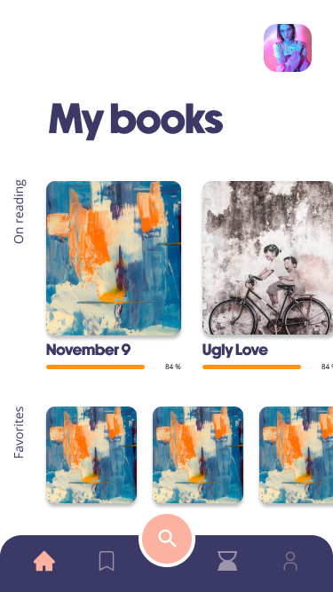
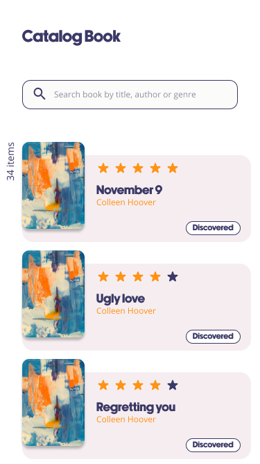
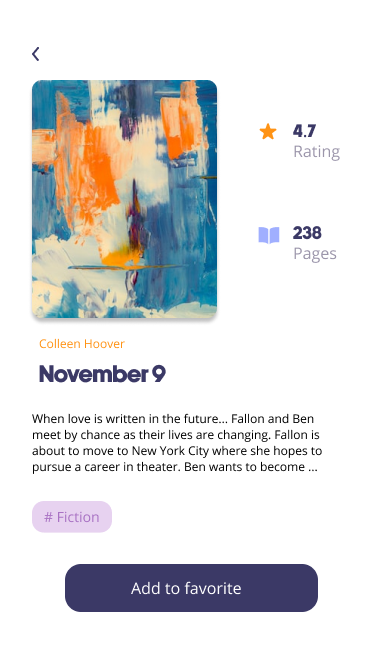

# lisa

A Flutter project to add list of books.

## Getting Started

This project is a starting point for a Flutter application.

A few resources to started this project:

- [app_ui : using to start app ui](https://github.com/Olivier-plessis/app_ui-flutter)
- [app_widget: Useful atomic design ](https://github.com/Olivier-plessis/app_widget)

## BackLogs

- [x] Design
- [ ] Clean Architecture
- [ ] Firebase configuration
- [ ] google sing_in authentication
- [ ] Dio - call api google books
- [ ] provider  - Riverpod 2.0
- [ ] state - Freezed
- [ ] hive - Save data inside local db
- [ ] search
- [ ] wishlist
- [ ] unit test

##Design

  

  