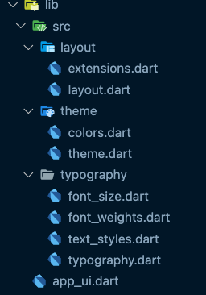

# app_ui package

Package to customize the ui.

## Packages structure
There are several local packages available in the `packages` directory. Their dependency structure is visible below:



### extensions

just a simple helper for paddings and how to use it

```
   Column(
          mainAxisAlignment: MainAxisAlignment.center,
          children: <Widget>[
            Text(
              'You have pushed the button this many times:',
              style: textTheme.headline1,
            ),
          ],
        ).paddedH(24),
```

### theme colors
all the colors to customize your app

### theme 
all themes for your dark / light app
in this file is included all the ThemeData (colors, radius, background ...)


### typography 

include 

| file | content |
| ------ | ------ |
| font_size | All text sizes |
| font_weight | All text weights |
| text_style | Declaration of all TextTheme in light and dark mode |


### Everything is exported to the app_ui.dart file

## Getting Started 🚀

To use it clone the project in a package folder at the root of your project and add these lines in your pubspec.yaml

```
app_ui:
    path: packages/app_ui
```
Required the installation of screenUtil [flutter_screenutil](https://pub.dev/packages/flutter_screenutil).


And in your hand use the code as follows

```
ScreenUtilInit(
    designSize: const Size(375, 750),
    splitScreenMode: true,
    minTextAdapt: true,
    builder: (
      BuildContext context,
      Widget? child,
    ) {
    return MaterialApp(
        debugShowCheckedModeBanner: false,
        title: 'Your Flutter App',
        theme: lightTheme,
        darkTheme: darkTheme,
        home: const MyHomePage(title: 'My Title'),
        );
      },
    )
```